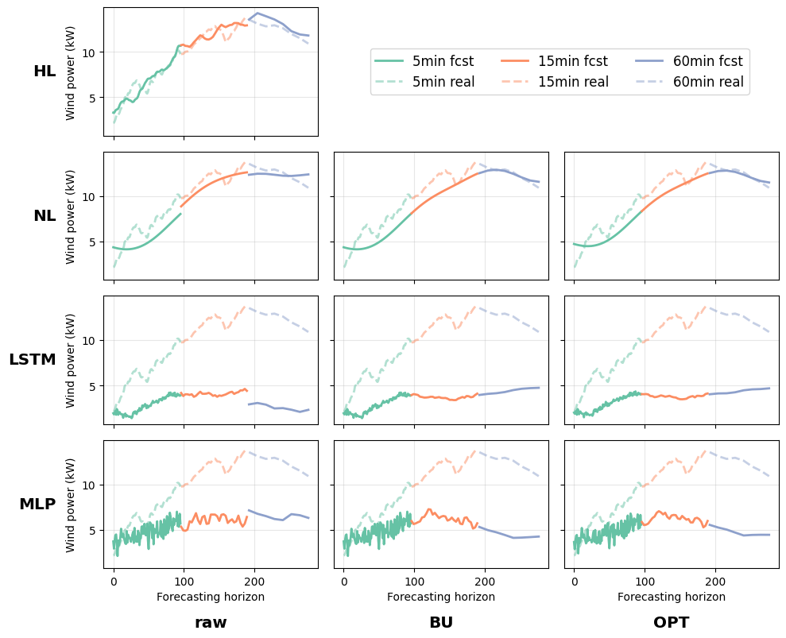

# Seamless and multi-resolution energy forecasting

Codes for paper "Seamless and multi-resolution energy forecasting". 

Authors: Chenxi Wang, Pierre Pinson, Yi Wang


## Requirements
Python version: 3.8.10

The must-have packages can be installed by running
```
pip install requirements.txt
```

## Experiments
### Reproduce
To reconstruct the same experiments in the paper, please run
```
bash run_experiments.sh
```
Note: There is no multi-GPU/parallelling training in our codes. 

The results(models) and logs will be saved into ```results/``` and ```logs/```. 

Then, go into ```00-post_analysis.ipynb``` for post analysis, including the post-coordination for benchmarks and the comparison of the total consistency error. Please replace the variable ```pth``` in the notebook.

If you also want to have the same figures in the papaer, please refer to ```01-plot.ipynb```.

### Example
An example of seamless multi-resolution forecasts on wind power from Hierarchical Laplace(HL) and benchmarks.




## Acknowledge
Package ```torchlapalace/``` is modified based on the open code of [Neural Laplace](https://github.com/samholt/NeuralLaplace)